# Demo系统操作手册

## 📋 目录

1. [系统概述](#系统概述)
2. [系统启动](#系统启动)
3. [登录系统](#登录系统)
4. [控制台](#控制台)
5. [用户管理](#用户管理)
6. [商品类型管理](#商品类型管理)
7. [商品管理](#商品管理)
8. [角色管理](#角色管理)
9. [菜单管理](#菜单管理)
10. [权限管理](#权限管理)
11. [安全配置](#安全配置)
12. [Redis管理](#redis管理)
13. [日志管理](#日志管理)
14. [接口测试](#接口测试)
15. [常见问题](#常见问题)

---

## 系统概述

Demo系统是一个基于Spring Boot和原生JavaScript开发的企业级管理系统，提供用户管理、商品管理、角色权限管理等核心功能。

### 主要功能模块

- **控制台**：系统概览和统计信息
- **用户管理**：用户的增删改查、角色分配
- **商品类型管理**：商品分类的管理
- **商品管理**：商品的增删改查
- **角色管理**：角色和权限的配置（管理员功能）
- **菜单管理**：系统菜单的配置（管理员功能）
- **权限管理**：API权限的配置（管理员功能）
- **安全配置**：安全白名单和权限配置（管理员功能）
- **Redis管理**：Redis缓存和Token管理（管理员功能）
- **日志管理**：操作日志的查询和导出（管理员功能）
- **接口测试**：API接口的测试工具

### 用户角色

- **超级管理员（SUPER_ADMIN）**：拥有所有权限
- **管理员（ADMIN）**：拥有大部分管理权限
- **普通用户（USER）**：基础功能权限

---

## 系统启动

### 1. 启动后端服务

**步骤1：** 进入后端项目目录

```bash
cd demo-app
```

**步骤2：** 启动Spring Boot应用

```bash
mvn spring-boot:run
```

**步骤3：** 验证后端服务

后端服务启动成功后，将运行在 `http://localhost:8081`


> **说明**：如果看到 "Started DemoApplication" 日志，说明后端启动成功。

### 2. 启动前端服务

**方式一：直接打开HTML文件**

1. 找到 `demo-frontend/index.html` 文件
2. 双击打开，或右键选择浏览器打开

**方式二：使用HTTP服务器（推荐）**

**使用Python：**

```bash
cd demo-frontend
python -m http.server 8000
```

**使用Node.js：**

```bash
cd demo-frontend
npx http-server -p 8000
```

**步骤3：** 访问前端页面

在浏览器中打开：`http://localhost:8000`


---

## 登录系统

### 登录页面

**步骤1：** 打开登录页面

访问 `http://localhost:8000/index.html` 或直接打开 `index.html`

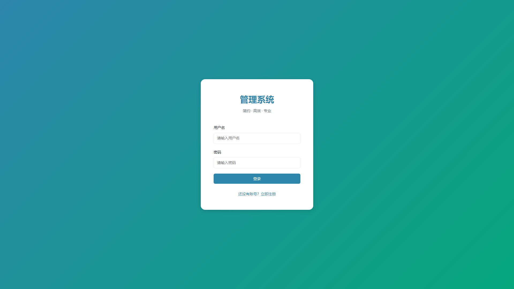

**页面说明：**
- 用户名输入框
- 密码输入框
- 登录按钮
- 注册链接（如果没有账号）

### 登录操作

**步骤2：** 输入登录信息

1. 在"用户名"输入框中输入用户名
   - 默认管理员账号：`admin`
   - 默认密码：`123456`

2. 在"密码"输入框中输入密码

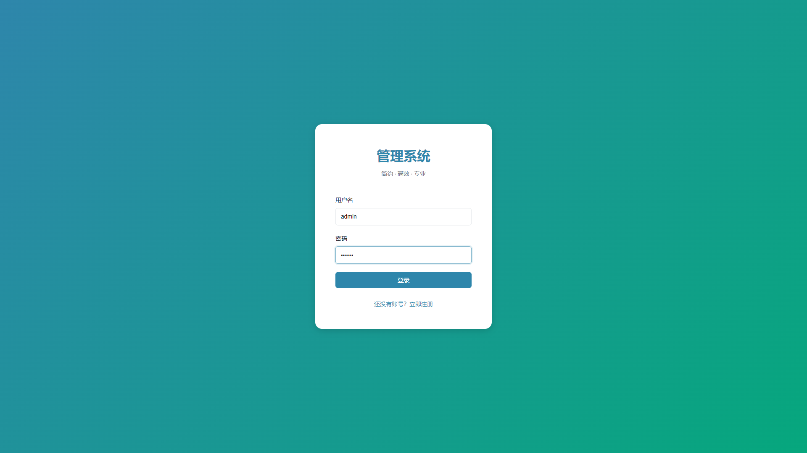

**步骤3：** 点击"登录"按钮

点击页面上的"登录"按钮，系统将验证用户信息。

**步骤4：** 登录成功

登录成功后，系统会自动跳转到主页面（控制台）。


> **注意**：
> - 如果用户名或密码错误，会显示错误提示
> - 登录成功后，Token会保存在浏览器的LocalStorage中
> - 如果30分钟无操作，Token会自动失效，需要重新登录

### 注册新用户

**步骤1：** 点击"注册"链接

在登录页面点击"还没有账号？立即注册"链接。

**步骤2：** 填写注册信息

1. 输入用户名（必填，唯一）
2. 输入密码（必填）
3. 确认密码（必填，需与密码一致）


**步骤3：** 提交注册

点击"注册"按钮，系统会创建新账号。

> **注意**：新注册的用户默认角色为"普通用户（USER）"，需要管理员分配更高权限。

---

## 控制台

### 控制台概览

登录成功后，默认进入控制台页面。

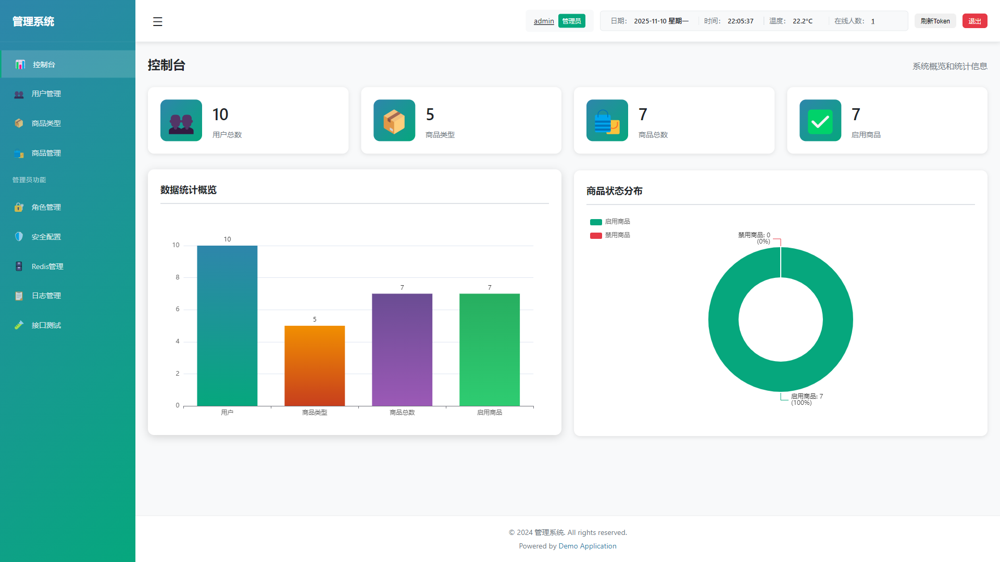

**页面组成：**
- 左侧：导航菜单
- 顶部：用户信息、时间、温度、在线人数、刷新Token按钮、退出按钮
- 中间：控制台内容区域

### 统计卡片

控制台显示四个统计卡片：

1. **用户总数**
   - 显示系统中的用户总数
   - 点击卡片可跳转到用户管理页面


2. **商品类型**
   - 显示商品类型总数
   - 点击卡片可跳转到商品类型管理页面


3. **商品总数**
   - 显示系统中的商品总数
   - 点击卡片可跳转到商品管理页面


4. **启用商品**
   - 显示已启用的商品数量
   - 点击卡片可跳转到商品管理页面


### 数据图表

控制台下方显示数据统计图表：

**步骤1：** 查看图表

图表使用ECharts展示，包括：
- 柱状图：展示各类数据统计
- 不同颜色区分不同数据类型


**步骤2：** 交互操作

- 鼠标悬停可查看详细数据
- 图表支持缩放和拖拽（如果启用）

### 顶部信息栏

**日期和时间：**
- 显示当前日期（格式：YYYY-MM-DD）
- 显示当前时间（格式：HH:MM:SS），实时更新

**温度：**
- 显示模拟温度值（示例功能）

**在线人数：**
- 显示当前在线用户数量
- 点击可查看在线用户列表

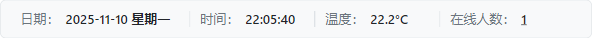

### 刷新Token

**步骤1：** 点击"刷新Token"按钮

在顶部导航栏右侧，点击"刷新Token"按钮。

**步骤2：** 确认刷新

系统会自动刷新Token，延长登录有效期。

> **说明**：Token默认有效期为30分钟，刷新后重新计时。

### 退出登录

**步骤1：** 点击"退出"按钮

在顶部导航栏右侧，点击红色的"退出"按钮。

**步骤2：** 确认退出

系统会弹出确认对话框，点击"确定"后退出登录。


**步骤3：** 返回登录页

退出成功后，自动跳转到登录页面。

---

## 用户管理

### 进入用户管理

**步骤1：** 点击左侧菜单

在左侧导航栏中，点击"👥 用户管理"菜单项。


**步骤2：** 进入用户列表页面

页面显示用户列表，包含搜索、新增、编辑、删除等功能。


### 用户列表

**列表字段说明：**
- **用户名**：用户的登录名
- **角色**：用户所属的角色（可多个）
- **创建时间**：账号创建时间
- **操作**：编辑、删除按钮

### 搜索用户

**步骤1：** 输入搜索条件

在搜索栏中输入用户名或角色名称。

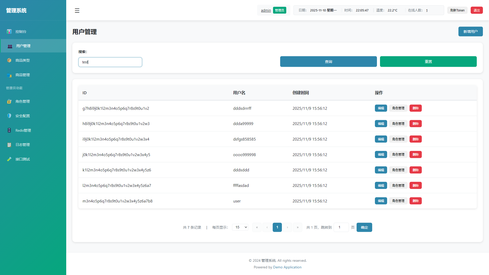

**步骤2：** 点击"查询"按钮

点击"查询"按钮，系统会筛选符合条件的用户。

**步骤3：** 重置搜索

点击"重置"按钮，清空搜索条件，显示所有用户。

### 新增用户

**步骤1：** 点击"新增用户"按钮

在用户列表页面，点击右上角的"新增用户"按钮。


**步骤2：** 填写用户信息

在弹出的对话框中填写：
- **用户名**：必填，唯一
- **密码**：必填
- **角色**：可多选，选择用户所属的角色

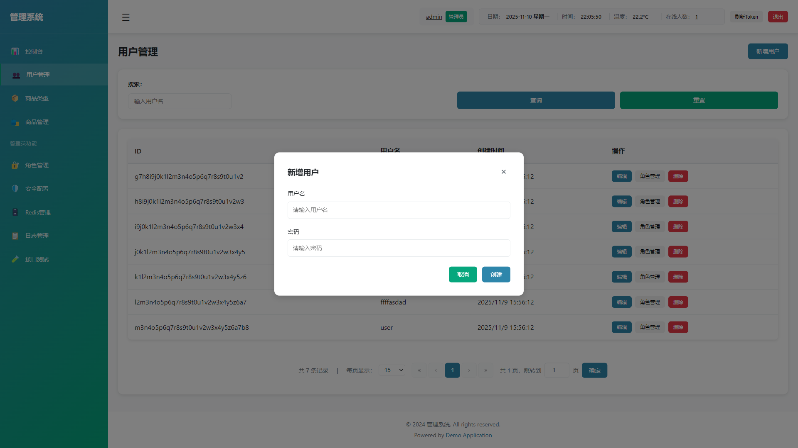

**步骤3：** 保存用户

点击"保存"按钮，系统会创建新用户。

**步骤4：** 确认创建

系统会弹出确认对话框，确认后创建用户。


**步骤5：** 查看结果

创建成功后，用户列表会自动刷新，显示新创建的用户。

### 编辑用户

**步骤1：** 点击"编辑"按钮

在用户列表中，找到要编辑的用户，点击该行的"编辑"按钮。


**步骤2：** 修改用户信息

在弹出的对话框中：
- 用户名会自动填充
- 可以修改密码（留空则不修改）
- 可以修改角色（可多选）


**步骤3：** 保存修改

点击"保存"按钮，系统会更新用户信息。

**步骤4：** 确认更新

系统会弹出确认对话框，确认后更新用户。

### 删除用户

**步骤1：** 点击"删除"按钮

在用户列表中，找到要删除的用户，点击该行的"删除"按钮。


**步骤2：** 确认删除

系统会弹出确认对话框，确认后删除用户。


> **注意**：删除操作不可恢复，请谨慎操作。

### 查看用户详情

**步骤1：** 点击用户名

在用户列表中，点击用户名可以查看用户详细信息。


**详情信息包括：**
- 用户名
- 角色列表
- 创建时间
- 更新时间
- 创建用户
- 更新用户

### 分页操作

**步骤1：** 查看分页控件

在用户列表底部，有分页控件。


**步骤2：** 切换页面

- 点击"上一页"按钮：跳转到上一页
- 点击"下一页"按钮：跳转到下一页
- 点击页码：跳转到指定页面
- 选择每页显示数量：10、20、50、100

**步骤3：** 查看总数

分页控件显示总记录数和当前页信息。

---

## 商品类型管理

### 进入商品类型管理

**步骤1：** 点击左侧菜单

在左侧导航栏中，点击"📦 商品类型"菜单项。


**步骤2：** 进入商品类型列表页面

页面显示商品类型列表。

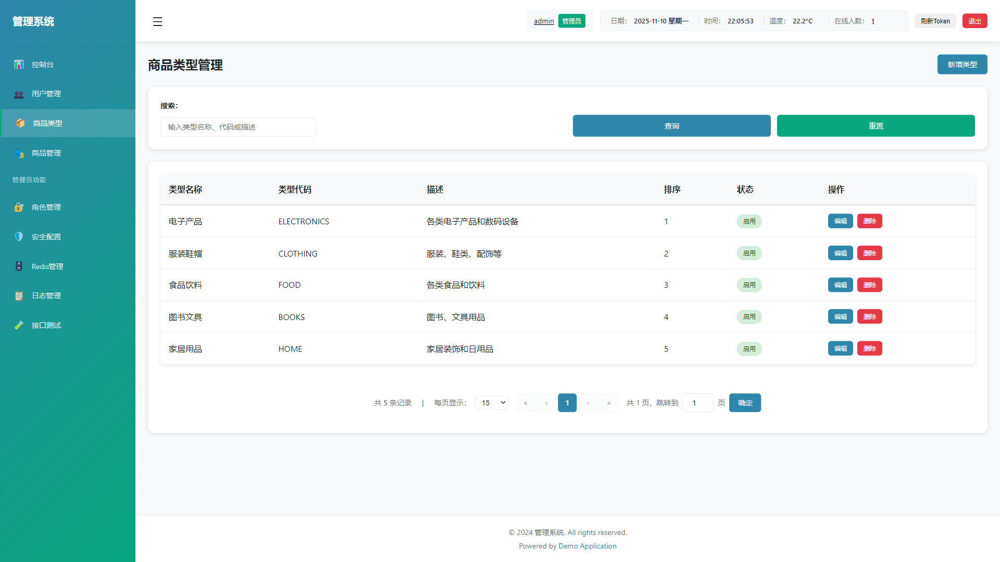

### 商品类型列表

**列表字段说明：**
- **类型名称**：商品类型的名称
- **排序**：显示顺序
- **创建时间**：创建时间
- **操作**：编辑、删除按钮

### 搜索商品类型

**步骤1：** 输入搜索条件

在搜索栏中输入类型名称。


**步骤2：** 点击"查询"按钮

点击"查询"按钮，系统会筛选符合条件的商品类型。

### 新增商品类型

**步骤1：** 点击"新增商品类型"按钮

在商品类型列表页面，点击右上角的"新增商品类型"按钮。


**步骤2：** 填写类型信息

在弹出的对话框中填写：
- **类型名称**：必填
- **排序**：数字，越小越靠前


**步骤3：** 保存类型

点击"保存"按钮，系统会创建新商品类型。

### 编辑商品类型

**步骤1：** 点击"编辑"按钮

在商品类型列表中，找到要编辑的类型，点击该行的"编辑"按钮。

**步骤2：** 修改类型信息

在弹出的对话框中修改类型名称和排序。

**步骤3：** 保存修改

点击"保存"按钮，系统会更新商品类型信息。

### 删除商品类型

**步骤1：** 点击"删除"按钮

在商品类型列表中，找到要删除的类型，点击该行的"删除"按钮。

**步骤2：** 确认删除

系统会弹出确认对话框，确认后删除商品类型。

> **注意**：如果该商品类型下有关联的商品，删除前需要先处理关联商品。

---

## 商品管理

### 进入商品管理

**步骤1：** 点击左侧菜单

在左侧导航栏中，点击"🛍️ 商品管理"菜单项。


**步骤2：** 进入商品列表页面

页面显示商品列表。

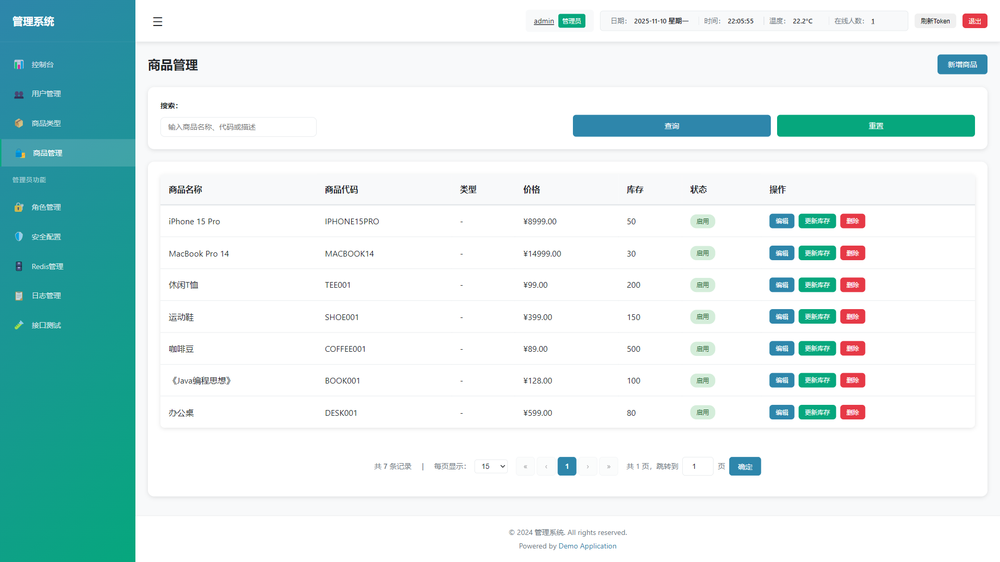

### 商品列表

**列表字段说明：**
- **商品名称**：商品的名称
- **商品类型**：所属的商品类型
- **价格**：商品价格
- **库存**：商品库存数量
- **状态**：启用/禁用
- **创建时间**：创建时间
- **操作**：编辑、删除按钮

### 搜索商品

**步骤1：** 输入搜索条件

在搜索栏中可以输入：
- 商品名称
- 商品类型


**步骤2：** 点击"查询"按钮

点击"查询"按钮，系统会筛选符合条件的商品。

### 新增商品

**步骤1：** 点击"新增商品"按钮

在商品列表页面，点击右上角的"新增商品"按钮。


**步骤2：** 填写商品信息

在弹出的对话框中填写：
- **商品名称**：必填
- **商品类型**：必填，从下拉列表选择
- **价格**：必填，数字
- **库存**：必填，数字
- **状态**：启用/禁用，默认启用
- **描述**：可选，商品描述


**步骤3：** 保存商品

点击"保存"按钮，系统会创建新商品。

### 编辑商品

**步骤1：** 点击"编辑"按钮

在商品列表中，找到要编辑的商品，点击该行的"编辑"按钮。

**步骤2：** 修改商品信息

在弹出的对话框中修改商品信息。

**步骤3：** 保存修改

点击"保存"按钮，系统会更新商品信息。

### 删除商品

**步骤1：** 点击"删除"按钮

在商品列表中，找到要删除的商品，点击该行的"删除"按钮。

**步骤2：** 确认删除

系统会弹出确认对话框，确认后删除商品。

### 启用/禁用商品

**步骤1：** 切换状态

在商品列表中，点击"状态"列的开关，可以快速启用或禁用商品。


---

## 角色管理

> **注意**：此功能仅管理员可见。

### 进入角色管理

**步骤1：** 确认权限

确保当前登录用户具有管理员权限。

**步骤2：** 点击左侧菜单

在左侧导航栏的"管理员功能"区域，点击"🔐 角色管理"菜单项。


**步骤3：** 进入角色列表页面

页面显示角色列表。

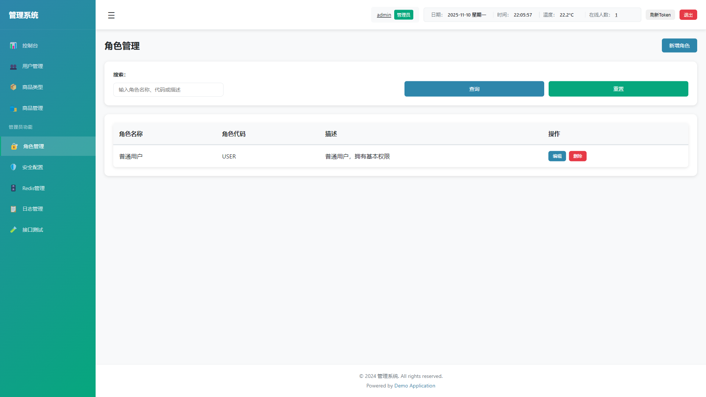

### 角色列表

**列表字段说明：**
- **角色名称**：角色的名称
- **角色代码**：角色的唯一代码
- **描述**：角色描述
- **创建时间**：创建时间
- **操作**：编辑、删除按钮

### 新增角色

**步骤1：** 点击"新增角色"按钮

在角色列表页面，点击右上角的"新增角色"按钮。


**步骤2：** 填写角色信息

在弹出的对话框中填写：
- **角色名称**：必填
- **角色代码**：必填，唯一，如：ADMIN、USER
- **描述**：可选


**步骤3：** 保存角色

点击"保存"按钮，系统会创建新角色。

### 编辑角色

**步骤1：** 点击"编辑"按钮

在角色列表中，找到要编辑的角色，点击该行的"编辑"按钮。

**步骤2：** 修改角色信息

在弹出的对话框中：
- 可以修改角色名称和描述
- 可以配置菜单权限（在权限列表中搜索、选择、分页选择）


**步骤3：** 配置菜单权限

在"菜单权限"区域：
- 使用搜索框搜索菜单
- 使用复选框选择菜单
- 使用分页控件切换页面
- 支持跨页选择


**步骤4：** 保存修改

点击"保存"按钮，系统会更新角色信息和权限。

### 管理用户角色

**步骤1：** 在用户列表中操作

进入用户管理页面，点击用户的"管理角色"按钮。


**步骤2：** 分配角色

在弹出的对话框中：
- 显示所有可用角色
- 使用复选框选择角色（可多选）
- 已选中的角色会显示在列表中


**步骤3：** 保存分配

点击"保存"按钮，系统会更新用户的角色。

---

## 菜单管理

> **注意**：此功能仅管理员可见。

### 进入菜单管理

**步骤1：** 点击左侧菜单

在左侧导航栏的"管理员功能"区域，点击"📑 菜单管理"菜单项。


**步骤2：** 进入菜单列表页面

页面显示菜单列表。


### 菜单列表

**列表字段说明：**
- **菜单名称**：菜单的显示名称
- **菜单代码**：菜单的唯一代码
- **路径**：菜单对应的路径
- **图标**：菜单图标
- **排序**：显示顺序
- **状态**：启用/禁用
- **操作**：编辑、删除、权限配置按钮

### 搜索菜单

**步骤1：** 输入搜索条件

在搜索栏中输入菜单名称或菜单代码。

**步骤2：** 点击"查询"按钮

点击"查询"按钮，系统会筛选符合条件的菜单。

### 新增菜单

**步骤1：** 点击"新增菜单"按钮

在菜单列表页面，点击右上角的"新增菜单"按钮。


**步骤2：** 填写菜单信息

在弹出的对话框中填写：
- **菜单名称**：必填
- **菜单代码**：必填，唯一，如：USERS、PRODUCTS
- **路径**：可选，菜单对应的路径
- **图标**：可选，菜单图标
- **排序**：数字，越小越靠前
- **状态**：启用/禁用，默认启用


**步骤3：** 保存菜单

点击"保存"按钮，系统会创建新菜单。

### 编辑菜单

**步骤1：** 点击"编辑"按钮

在菜单列表中，找到要编辑的菜单，点击该行的"编辑"按钮。

**步骤2：** 修改菜单信息

在弹出的对话框中修改菜单信息。

**步骤3：** 保存修改

点击"保存"按钮，系统会更新菜单信息。

### 配置菜单权限

**步骤1：** 点击"权限配置"按钮

在菜单列表中，找到要配置权限的菜单，点击该行的"权限配置"按钮。


**步骤2：** 选择功能权限

在弹出的对话框中：
- 显示所有可用的功能权限（来自security_permission表）
- 使用搜索框搜索权限
- 使用复选框选择权限
- 使用分页控件切换页面


**步骤3：** 保存配置

点击"保存"按钮，系统会保存菜单的权限配置。

---

## 权限管理

> **注意**：此功能仅管理员可见。

### 进入权限管理

**步骤1：** 点击左侧菜单

在左侧导航栏的"管理员功能"区域，点击"🔑 权限管理"菜单项。


**步骤2：** 进入权限列表页面

页面显示权限列表。


### 权限列表

**列表字段说明：**
- **权限名称**：权限的显示名称
- **权限代码**：权限的唯一代码
- **API路径**：对应的API接口路径
- **请求方法**：HTTP方法（GET、POST、PUT、DELETE等）
- **状态**：启用/禁用
- **创建时间**：创建时间
- **操作**：编辑、删除按钮

### 搜索权限

**步骤1：** 输入搜索条件

在搜索栏中输入权限名称、权限代码或API路径。

**步骤2：** 点击"查询"按钮

点击"查询"按钮，系统会筛选符合条件的权限。

### 新增权限

**步骤1：** 点击"新增权限"按钮

在权限列表页面，点击右上角的"新增权限"按钮。


**步骤2：** 填写权限信息

在弹出的对话框中填写：
- **权限名称**：必填
- **权限代码**：必填，唯一
- **API路径**：必填，如：/api/users
- **请求方法**：必填，从下拉列表选择
- **状态**：启用/禁用，默认启用


**步骤3：** 保存权限

点击"保存"按钮，系统会创建新权限。

### 编辑权限

**步骤1：** 点击"编辑"按钮

在权限列表中，找到要编辑的权限，点击该行的"编辑"按钮。

**步骤2：** 修改权限信息

在弹出的对话框中修改权限信息。

**步骤3：** 保存修改

点击"保存"按钮，系统会更新权限信息。

### 启用/禁用权限

**步骤1：** 切换状态

在权限列表中，点击"状态"列的开关，可以快速启用或禁用权限。


---

## 安全配置

> **注意**：此功能仅管理员可见。

### 进入安全配置

**步骤1：** 点击左侧菜单

在左侧导航栏的"管理员功能"区域，点击"🛡️ 安全配置"菜单项。


**步骤2：** 进入安全配置页面

页面包含两个标签页：白名单管理和权限管理。

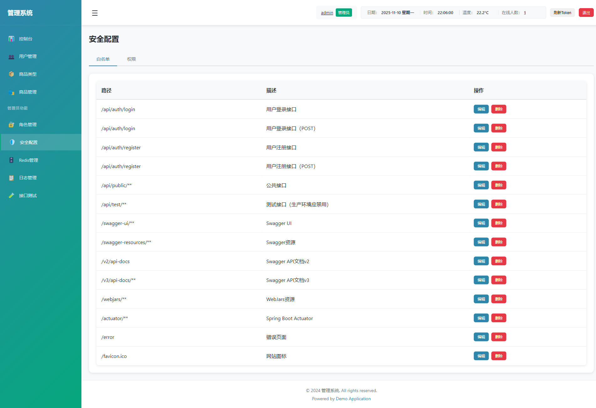

### 白名单管理

**功能说明：**
白名单中的API路径不需要登录即可访问。

**步骤1：** 查看白名单列表

在"白名单管理"标签页中，显示所有白名单配置。


**步骤2：** 新增白名单

1. 点击"新增白名单"按钮
2. 填写API路径（如：/api/public/**）
3. 点击"保存"按钮


**步骤3：** 删除白名单

1. 找到要删除的白名单
2. 点击"删除"按钮
3. 确认删除

### 权限管理

**功能说明：**
配置API路径与权限的关联关系。

**步骤1：** 查看权限配置列表

在"权限管理"标签页中，显示所有权限配置。


**步骤2：** 新增权限配置

1. 点击"新增权限配置"按钮
2. 选择API路径
3. 选择权限
4. 点击"保存"按钮


**步骤3：** 删除权限配置

1. 找到要删除的权限配置
2. 点击"删除"按钮
3. 确认删除

---

## Redis管理

> **注意**：此功能仅管理员可见。

### 进入Redis管理

**步骤1：** 点击左侧菜单

在左侧导航栏的"管理员功能"区域，点击"🗄️ Redis管理"菜单项。


**步骤2：** 进入Redis管理页面

页面显示Redis信息和Token管理。

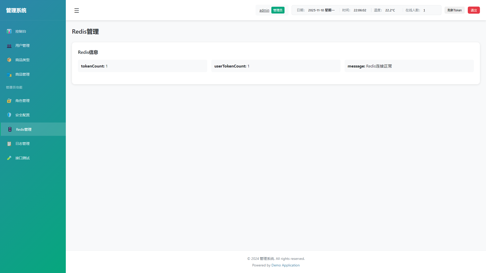

### Redis信息

**步骤1：** 查看Redis信息

页面显示Redis的基本信息：
- Redis连接状态
- 内存使用情况
- Key数量等


### Token管理

**步骤1：** 查看在线Token

在"Token管理"区域，显示所有在线用户的Token信息。


**步骤2：** 删除Token

1. 找到要删除的Token
2. 点击"删除"按钮
3. 确认删除

> **说明**：删除Token后，对应用户需要重新登录。

### 刷新Token

**步骤1：** 点击"刷新Token"按钮

在顶部导航栏，点击"刷新Token"按钮，可以延长当前用户的Token有效期。

---

## 日志管理

> **注意**：此功能仅管理员可见。

### 进入日志管理

**步骤1：** 点击左侧菜单

在左侧导航栏的"管理员功能"区域，点击"📋 日志管理"菜单项。


**步骤2：** 进入日志列表页面

页面显示操作日志列表。

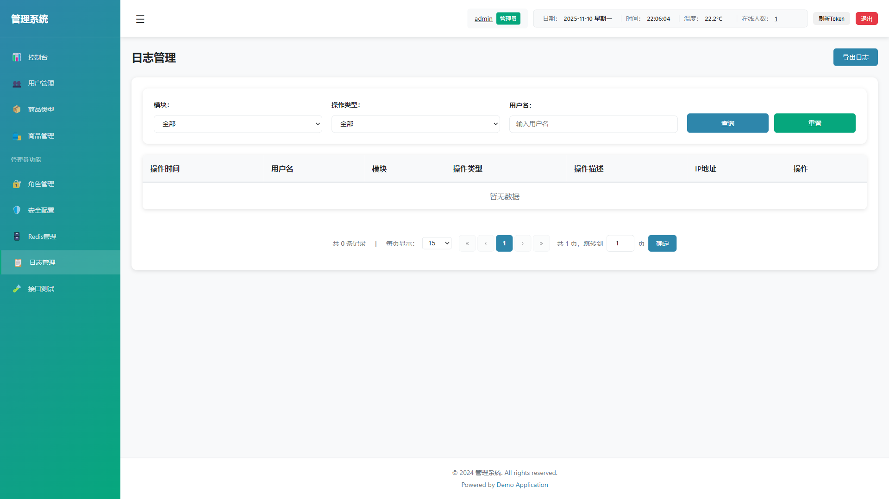

### 日志列表

**列表字段说明：**
- **操作类型**：操作类型（CREATE、UPDATE、DELETE等）
- **操作对象**：操作的对象（如：用户、商品等）
- **操作内容**：操作的详细内容
- **操作人**：执行操作的用户
- **操作时间**：操作时间
- **操作**：查看详情按钮

### 搜索日志

**步骤1：** 输入搜索条件

在搜索栏中可以输入：
- 操作类型
- 操作对象
- 操作人
- 时间范围


**步骤2：** 点击"查询"按钮

点击"查询"按钮，系统会筛选符合条件的日志。

**步骤3：** 重置搜索

点击"重置"按钮，清空搜索条件。

### 查看日志详情

**步骤1：** 点击"查看详情"按钮

在日志列表中，找到要查看的日志，点击该行的"查看详情"按钮。


**步骤2：** 查看详细信息

在弹出的对话框中显示日志的详细信息：
- 操作类型
- 操作对象
- 操作内容（JSON格式）
- 操作人
- 操作时间
- IP地址等


### 导出日志

**步骤1：** 点击"导出日志"按钮

在日志列表页面，点击右上角的"导出日志"按钮。


**步骤2：** 选择导出范围

可以选择导出当前查询结果或所有日志。

**步骤3：** 下载文件

系统会生成CSV或TXT格式的日志文件，自动下载。


---

## 接口测试

### 进入接口测试

**步骤1：** 点击左侧菜单

在左侧导航栏中，点击"🧪 接口测试"菜单项。


**步骤2：** 进入接口测试页面

页面提供API接口测试工具。

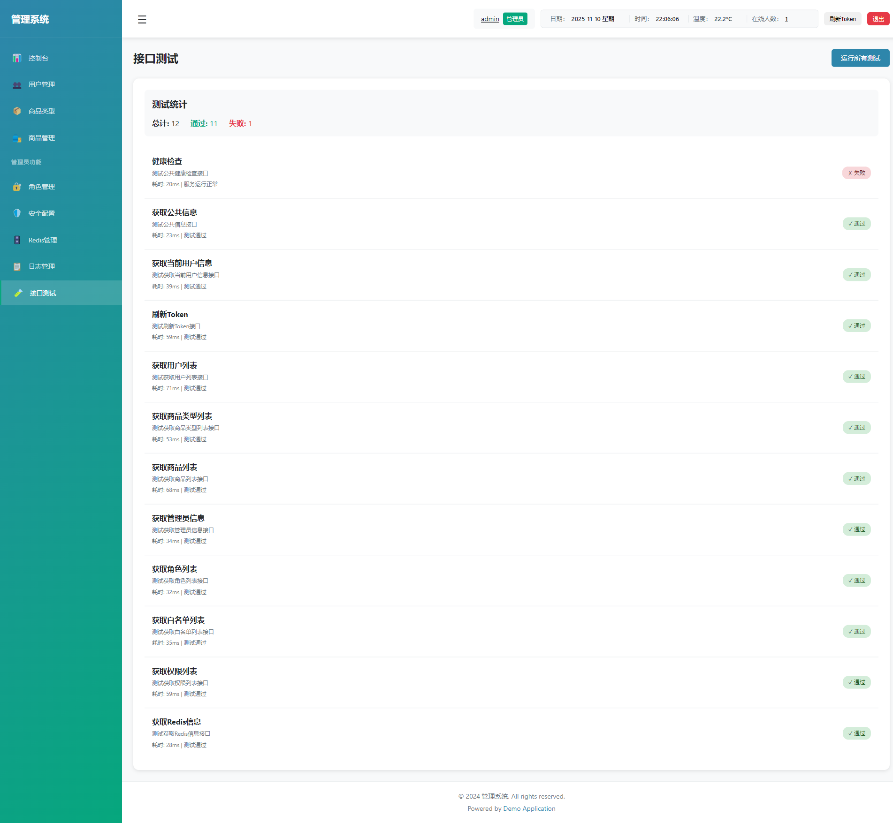

### 测试接口

**步骤1：** 选择请求方法

在下拉列表中选择HTTP方法（GET、POST、PUT、DELETE等）。


**步骤2：** 输入API路径

在输入框中输入API路径，如：`/api/users`


**步骤3：** 添加请求头（可选）

如果需要，可以添加自定义请求头。

**步骤4：** 添加请求体（可选）

对于POST、PUT请求，可以添加JSON格式的请求体。


**步骤5：** 发送请求

点击"发送请求"按钮，系统会发送请求并显示响应结果。


**步骤6：** 查看响应

在响应区域显示：
- 响应状态码
- 响应头
- 响应体（JSON格式）


---

## 常见问题

### 1. 登录失败

**问题：** 输入用户名和密码后，提示登录失败。

**解决方案：**
- 检查用户名和密码是否正确
- 确认后端服务是否已启动
- 检查浏览器控制台是否有错误信息
- 确认API地址配置是否正确

### 2. Token过期

**问题：** 操作时提示Token过期。

**解决方案：**
- 点击"刷新Token"按钮延长有效期
- 或重新登录获取新Token

### 3. 权限不足

**问题：** 点击某些菜单时提示"没有权限"。

**解决方案：**
- 确认当前用户角色是否具有相应权限
- 联系管理员分配权限

### 4. 数据不显示

**问题：** 列表页面显示"0条记录"或数据不显示。

**解决方案：**
- 检查后端服务是否正常运行
- 检查数据库连接是否正常
- 查看浏览器控制台是否有错误
- 检查网络请求是否成功

### 5. 搜索不生效

**问题：** 输入搜索条件后，点击查询没有结果。

**解决方案：**
- 确认搜索条件是否正确
- 检查后端API是否正常响应
- 查看浏览器控制台的网络请求

### 6. 分页不工作

**问题：** 点击分页按钮没有反应。

**解决方案：**
- 刷新页面重试
- 检查JavaScript控制台是否有错误
- 确认数据总数是否正确

### 7. 无法删除数据

**问题：** 点击删除按钮后，数据没有被删除。

**解决方案：**
- 检查是否有外键约束
- 确认是否有删除权限
- 查看后端日志是否有错误信息

---

## 截图说明

本文档中的所有截图都保存在 `screenshots/` 目录下。

**GitHub显示说明**：所有截图路径都使用相对路径 `./screenshots/`，确保在GitHub上查看文档时截图可以正常显示。

### 截图命名规范

- 使用小写字母和下划线
- 格式：`模块_功能_描述.png`
- 示例：
  - `login_page.png` - 登录页面
  - `users_list.png` - 用户列表
  - `products_add_form.png` - 商品新增表单

### 如何添加截图

1. **截取屏幕截图**
   - 使用系统截图工具（Windows: Win+Shift+S）
   - 或使用浏览器开发者工具截图功能

2. **保存截图**
   - 将截图保存到 `screenshots/` 目录
   - 使用规范的命名格式

3. **更新文档**
   - 在文档的相应位置添加截图引用
   - 格式：``

### 截图要求

- **分辨率**：建议使用1920x1080或更高分辨率
- **格式**：PNG格式（支持透明背景）
- **大小**：单个文件不超过2MB
- **内容**：清晰可见，关键信息突出

---

## 技术支持

如有问题或建议，请联系系统管理员。

**最后更新：** 2025-11-09

